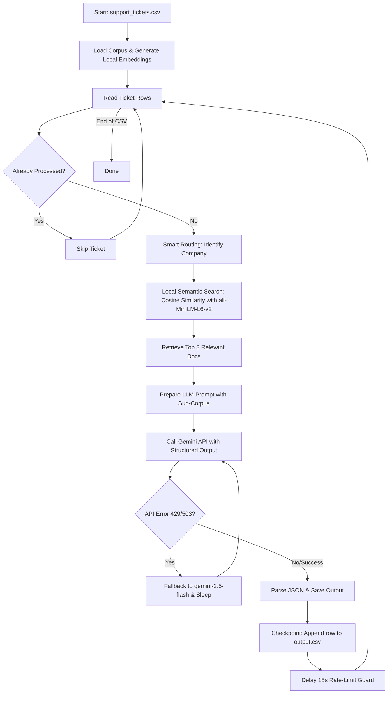

# AI Support Triage Agent 🤖✈️

A highly resilient, cost-effective, and fully local RAG-powered AI agent designed to triage support tickets across three product ecosystems: **HackerRank**, **Claude**, and **Visa**. 

This project was built as a solution for the **HackerRank Orchestrate** challenge. It utilizes local semantic search for zero-cost document retrieval, implements a high-availability fallback loop with the Gemini API using Pydantic structured outputs, and checkpoints processing in real-time to guarantee idempotent execution.

---

## 🏗️ System Architecture

The agent processes incoming tickets sequentially, running each through a pipeline that integrates local similarity search with robust LLM processing:



---

## 🌟 Core Architectural Features

### 1. Zero-Cost Local Semantic Search (RAG)
To avoid the latency and token costs of cloud-based embedding APIs, this agent implements a fully local RAG pipeline:
* Uses the **`all-MiniLM-L6-v2`** transformer model from `sentence-transformers` to embed the support corpus.
* Uses **NumPy** to calculate vector cosine similarity in-memory.
* Pre-filters the support corpus based on the ticket's target company (Smart Routing) before performing similarity search to maximize speed and precision.

### 2. High-Availability Fallback & Structured Outputs
Using Gemini's Structured Outputs (enforced via Pydantic schemas), the agent guarantees that responses conform exactly to the required JSON schema. To handle transient failures:
* It defaults to `gemini-3.1-flash-lite-preview` for ultra-fast, low-cost processing.
* In the event of a `429` (Rate Limit Exceeded) or `503` (Service Unavailable) error, it executes an exponential backoff retry loop.
* If rate limits persist, it automatically routes subsequent retries to `gemini-2.5-flash` to ensure maximum reliability and availability.

### 3. Idempotent Real-Time Checkpointing
Designed to run on large datasets without fear of network dropouts or crashes:
* Every processed ticket is appended directly to `support_tickets/output.csv` in real-time.
* Upon startup, the script checks `output.csv`, compiles a list of successfully completed ticket IDs, and skips them.
* Only failed, rate-limited, or unprocessed tickets are retried, ensuring zero redundant API calls.

---

## 🛠️ Getting Started

### Prerequisites
* Python 3.9 or higher
* A Gemini API Key (get one from [Google AI Studio](https://aistudio.google.com/))

### Installation & Setup

1. **Clone the Repository**
   ```bash
   git clone https://github.com/your-username/ai-support-triage-agent.git
   cd ai-support-triage-agent
   ```

2. **Create a Virtual Environment**
   ```bash
   python -m venv venv
   # Windows
   venv\Scripts\activate
   # macOS/Linux
   source venv/bin/activate
   ```

3. **Install Dependencies**
   ```bash
   pip install -r code/requirements.txt
   ```

4. **Set Up Environment Variables**
   Create a `.env` file in the root directory:
   ```env
   GEMINI_API_KEY=your_gemini_api_key_here
   ```

---

## 🚀 Running the Agent

To run the agent on the target support tickets dataset, execute the script from the root directory:

```bash
python code/main.py
```

### Input/Output Files
* **Input Dataset:** `support_tickets/support_tickets.csv` (contains ticket issues and subjects).
* **Reference Corpus:** `data/` (contains local markdown/text support documentation for each company).
* **Output Predictions:** `support_tickets/output.csv` (contains the triaged results).

---

## 📊 Evaluation Schema

The agent classifies tickets into one of the following schemas:

* **`status`**: `replied` (if the issue can be safely answered from the local corpus) or `escalated` (if high-risk, sensitive, or unsupported).
* **`product_area`**: The most relevant support category (e.g., *Billing*, *Security*, *Account Access*).
* **`response`**: A user-facing response grounded strictly in the provided support corpus.
* **`justification`**: A concise explanation explaining why the agent chose the response or chose to escalate.
* **`request_type`**: `product_issue`, `feature_request`, `bug`, or `invalid`.